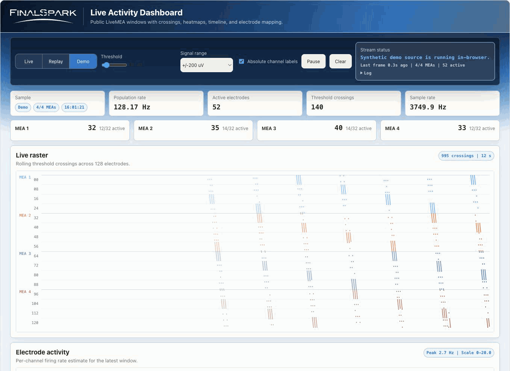
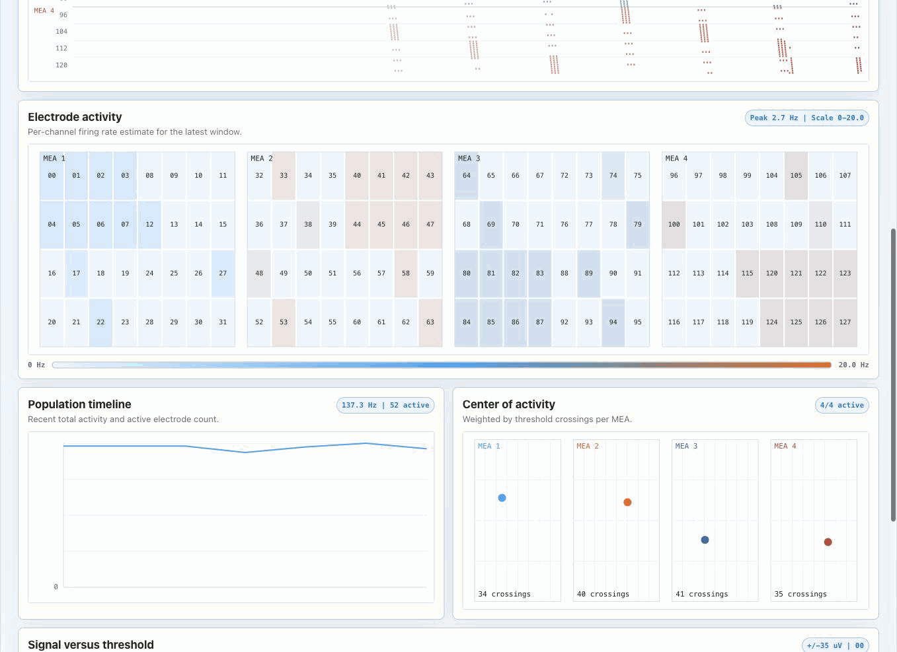
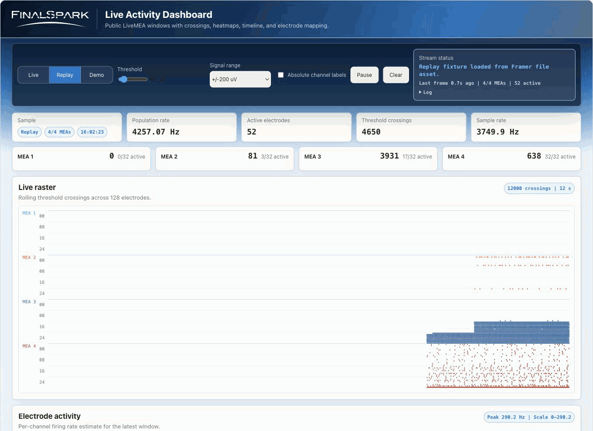

# fs-kernel

Embeddable, zero-build time-series viewer for browser pages. The kernel is a read-only signal surface: adapters feed normalized voltage frames, the core keeps a bounded time window, and the views render threshold crossings, logical electrode maps, activity timeline, Center of Activity, and signal-threshold inspection.

The included live adapter uses the public FinalSpark LiveMEA stream. This project is public-stream-only: no Neuroplatform credentials, booked hardware access, private datasets, or platform APIs.

Standalone demo: https://finalsnake.framer.ai/

## In Action







## Run Locally

```sh
npm run serve
```

Then open `http://localhost:4173`.

No install step is required for the app. Tests use the built-in Node.js test runner:

```sh
npm test
```

## Embed In 15 Minutes

Use the root ES module from any static host:

```html
<div id="fsk"></div>
<script type="module">
  import { mount } from "https://your-host.example/fs-kernel.mjs";

  mount("#fsk", {
    source: "frozen",
    src: "https://your-host.example/data/replay-sample.json",
    height: 720,
    view: "overview",
    window: 12
  });
</script>
```

The custom element path is also available:

```html
<script type="module" src="https://your-host.example/fs-kernel.mjs"></script>
<fs-kernel source="frozen" src="https://your-host.example/data/replay-sample.json" view="mapping" window="12"></fs-kernel>
```

Options:

- `source`: `live`, `frozen`, or `demo`.
- `src`: frozen source JSON URL.
- `height`: CSS length or pixel number for the embedded viewport.
- `view`: `overview`, `mapping`, or `explain`.
- `window`: rolling time window in seconds.
- `meaId`: optional one-MEA public live selection, `1` through `4`.

The embed renders in Shadow DOM, so styles do not leak in or out. It runs from static HTML/CSS/ES modules without npm, React, Vue, or a bundler.

## Source Adapters

All sources implement the same adapter shape:

- `meta()` returns `channelCount`, `sampleRateHz`, `sampleCount`, `units`, `layout`, `sourceKind`, `label`, and optional `sourceProvenance`.
- `start(onFrame, onStatus)` begins delivery.
- `stop()` closes sockets or timers and is safe to call repeatedly.
- `seek(t)` is optional for frozen/recorded sources.

Every adapter emits the same normalized frame:

```js
{
  tStart,
  tEnd,
  channelCount,
  sampleCount,
  sampleRateHz,
  units: "uV",
  samples: Float32Array,
  availableChannels: Uint8Array
}
```

The core stores only this generic frame contract. FinalSpark, Socket.IO, and MEA selection details live in the live adapter.

## Data Sources

- `Live`: public FinalSpark LiveMEA adapter. It uses polite Socket.IO websocket connections with reconnect backoff and closes them when stopped.
- `Frozen`: `data/replay-sample.json`, a bundled real public-stream capture normalized through the same adapter contract.
- `Demo`: deterministic synthetic voltage traces generated in the browser.

## What The Views Show

- `Activity Raster`: threshold crossings across available channels.
- `Activity-Rate Heatmap`: logical electrode layout by index, grouped as 4 MEAs x 32 electrodes for the included public live/frozen layout.
- `Activity Timeline`: population threshold crossings over recent frames.
- `Center of Activity`: weighted average electrode position from crossing counts, following the formula described in the Frontiers paper DOI `10.3389/frai.2024.1376042`.
- `Signals vs Noise`: a probe trace with the current threshold band.
- `URL State`: shareable `source`, `view`, `window`, `threshold`, `range`, `labels`, and frozen `position` parameters.

Threshold crossings are coarse activity markers. They are not sorted units and no cell identity is inferred. The electrode grid is a logical layout by index; no biological area is inferred.

## Verified Public Stream Contract

Verification was done before writing app code. Details are in `docs/VERIFY.md`.

- Public page: `https://finalspark.com/live/`
- Browser app iframe: `https://livemea.finalspark.com/liveview`
- Primary websocket: `wss://livemeaservice.finalspark.com/socket.io/?EIO=4&transport=websocket`
- Fallback websocket: `wss://livemeaservice2.alpvision.com/socket.io/?EIO=4&transport=websocket`
- Protocol: Engine.IO 4 plus Socket.IO event framing.
- Selection: after namespace connect, send `42["meaid", index]` where `index` is zero-based.
- Delivery: the server pushes a `livedata` placeholder text packet followed by one binary frame.
- Frame shape: `32 * 4096` little-endian `float32` values per MEA, `524288` bytes.
- Units: raw voltage in microvolt-scale values, matching the official `+/-50` to `+/-2000 uV` range control.
- Cadence: approximately one `4096` sample window per `1092.3 ms`, about `3.75 kHz`.

## Roadmap Notes

NWB excerpt support is a future adapter, not part of this version. LSL support would require a websocket bridge backed by `pylsl` or `liblsl`; browsers do not speak native LSL over UDP multicast directly.

## Project Shape

The app is plain static HTML, CSS, and ES modules:

- `fs-kernel.mjs`: public `mount()` API and `<fs-kernel>` custom element.
- `src/kernel/time-series-core.js`: bounded generic time-series frame buffer.
- `src/data/*`: live, frozen, demo, normalized frame helpers, and Socket.IO packet helpers.
- `src/mapping.js`: absolute/local channel mapping and logical layout used by the included MEA views.
- `src/crossing-detection.js`: threshold crossing detection.
- `src/url-state.js`: query string parsing.
- `src/metrics.js`: rates, population activity, and Center of Activity.
- `src/render/*`: canvas renderers for raster, heatmap, timeline, CoA, and trace explanation.
- `embed-example.html`: one-import frozen-source embed example.
- `framer/FinalSparkLiveViz.tsx`: Framer showcase shell for the published site.

The kernel should run from any simple static host, including GitHub Pages.
